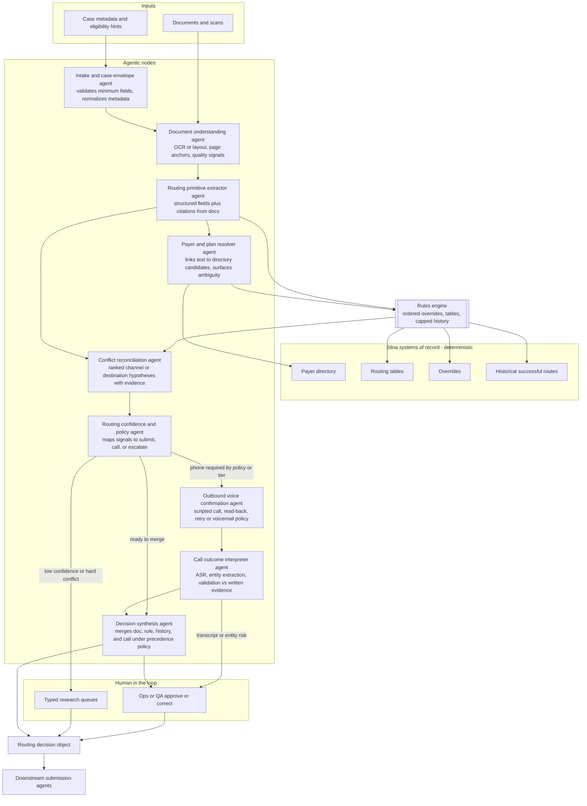

# Planning document: prior authorization routing and confirmation

This document describes how I would plan an **internal** workflow at Silna whose job is to decide **where a given procedure or treatment authorization should be submitted**—which payer or channel, and with what destination details—and to **confirm by phone** when the written record is missing, ambiguous, or unreliable.

---

## 1. Problem statement

Silna’s submission agents need a reliable upstream answer to a narrow question:

> For this authorization case (patient, plan, provider or facility, service or CPT/HCPCS, urgency, attachments), **what is the correct submission path**—portal, fax, email, mail, or another defined channel—and **what exact destination** (URL, number, address, mailbox) should we use?

That question is harder than it sounds because:

- Instructions live in payer PDFs, portals, faxes, and referral packets, often scanned.
- The “right” path can depend on plan, line of business, service type, or site-specific contracts.
- Written instructions go stale; provider staff often know the current path better than a six-month-old cover sheet.

So the workflow is not “LLM picks fax or email.” It is **evidence gathering, constrained inference, and mandatory confirmation when confidence or agreement across sources is too low**—with a **phone confirmation** step as a first-class part of the design, not an afterthought.

---

## 2. Goals and non-goals

**Goals**

- Produce a **structured routing recommendation** Silna’s submission automation can consume: payer identity, channel, destination identifiers, supporting evidence, confidence, and next action (submit vs confirm vs escalate).
- Reduce **wrong-channel and wrong-destination** submissions, which waste time and hurt first-pass acceptance.
- Make decisions **auditable** for internal QA: why we chose this path, which text or rule supported it, what the phone call confirmed.
- Fit into a **human-in-the-loop** operating model: internal users can override, approve, or send to research queues.

**Non-goals (for this planning slice)**

- Fully automated end-to-end submission without human approval (unless a later phase explicitly defines safe autopilot boundaries).
- Clinical appropriateness of the auth request itself (that belongs elsewhere).
- Negotiating with payers or appealing denials (downstream).

---

## 3. Internal users and handoffs

Typical consumers of the output:

- **Submission / ops** — needs channel, destination, and any special instructions (cover sheet, reference numbers, attachments).
- **QA or team lead** — needs evidence and confidence to spot systematic errors.
- **Knowledge or content team** — uses disagreements and confirmations to update routing tables and payer playbooks.

The workflow should assume **multiple people** might touch a case; the artifact is a **case record**, not a one-off chat response.

---

## 4. Inputs we standardize on

Everything the router sees should be normalized into a **case envelope** (names vary by implementation):

| Category             | Examples                                                                                       |
| -------------------- | ---------------------------------------------------------------------------------------------- |
| Patient and coverage | Member ID, group, plan name, payer name, line of business if known                             |
| Service              | CPT/HCPCS, diagnosis pointers, place of service, inpatient vs outpatient, urgency              |
| Provider / facility  | NPI, tax ID, site name, department, rendering vs billing provider as applicable                |
| Documents            | Auth form, payer medical policy excerpt, referral, clinical notes, any “where to submit” page  |
| Silna context        | Prior successful routes for same payer + provider pattern, internal overrides, known incidents |

**OCR and layout:** scanned pages should retain **page and region references** so evidence can point to “page 3, block under ‘Submit requests to’” rather than a floating string.

---

## 5. Outputs we require

Every run should emit a **routing decision object** (conceptually):

1. **Payer / plan resolution** — which insurance entity we believe is responsible for this auth (and uncertainty if multiple candidates).
2. **Recommended channel** — portal, fax, email, mail, or “unknown / multiple.”
3. **Destination** — normalized fields per channel (fax E.164 or normalized digits, email with domain allowlist checks, portal base URL + any required path hints, mailing address split into structured lines).
4. **Evidence** — short quotes or pointers into documents and rules; no orphan decisions.
5. **Confidence** — discrete levels or scores, with a defined mapping to **automation vs confirm vs escalate** (see section 8).
6. **Phone confirmation** — status: not required, scheduled, completed, failed; structured outcome if completed (see section 7).
7. **Human disposition** — approved, corrected, escalated to research, with optional free text.

Downstream submission agents only need a subset, but QA and learning loops need the full object.

---

## 5a. System architecture: Agentic nodes

The diagram below maps the pipeline to **implementable nodes**. “Agentic” here means a component that reasons over unstructured input, uses tools or policies adaptively, or runs a conversational / voice loop; **rules engines and curated tables** stay deterministic so routing stays auditable.

### How this lines up with stages A–G

| Stage                           | Architecture                                                                                       |
| ------------------------------- | -------------------------------------------------------------------------------------------------- |
| A — Ingest and normalize        | **Intake agent** plus **Document understanding agent**                                             |
| B — Extract routing primitives  | **Routing primitive extractor agent**                                                              |
| C — Resolve payer and plan      | **Payer and plan resolver agent** plus payer directory lookups                                     |
| D — Rule-first routing          | **Rules engine** reading routing tables, overrides, and history (not an LLM)                       |
| E — Interpretive reconciliation | **Conflict reconciliation agent** fed by primitives, rule output, and explicit conflict list       |
| F — Phone confirmation          | **Outbound voice confirmation agent** then **Call outcome interpreter agent**                      |
| G — Finalize and hand off       | **Decision synthesis agent**, then optional **Ops or QA** before the routing decision object ships |

### Optional orchestration pattern

In production you often wrap the agent row in a **workflow orchestrator** (temporal graph, state machine, or job queue) that owns retries, idempotency, and case versioning. That orchestrator is usually not “agentic”; it calls each node with a fixed contract so every step stays replayable for audits.

---

## 6. Workflow stages (high level)

Think of this as a **pipeline with branches**, not one prompt.

### Stage A — Ingest and normalize

- Accept uploads and metadata; validate minimum fields to even attempt routing.
- Run OCR/layout where needed; store quality signals (blur, low confidence characters) for gating.

### Stage B — Extract “routing primitives”

Separate **extraction** from **routing**:

- **Primitives** include: payer names, plan names, “submit to” lines, fax numbers, emails, URLs, “for X plan use Y portal” tables, deadlines, and special instructions.
- Extraction should prefer **structured fields + citations** over narrative summaries.

Models may assist here; **deterministic parsers** (regex for E.164, URL validation, known payer headers) should run where they are reliable.

### Stage C — Resolve payer and plan context

- Match extracted payer strings to **Silna’s payer directory** (IDs, aliases, parent/child relationships).
- Apply **plan-level** hints when member eligibility or trading partner data is available.

If payer cannot be resolved to a single candidate, **do not guess the submission address**; mark ambiguity and move toward confirmation or human triage.

### Stage D — Rule-first routing

Apply, in a documented order:

1. **Hard overrides** (incident-driven: “do not use fax X until further notice”).
2. **Curated routing tables** keyed by payer, product line, service type, or region.
3. **Historical success** for the same or similar case fingerprint (with staleness limits and caps on how much history can override written instructions when they conflict).

Only after this should **interpretive** steps reconcile conflicting text (e.g., two different fax numbers on different pages).

### Stage E — Interpretive reconciliation (assisted)

When documents disagree or instructions are conditional (“if outpatient, fax; if inpatient, portal”), use constrained reasoning:

- Inputs: primitives + rule outcomes + conflict list.
- Output: ranked hypotheses, each with evidence—not a single silent choice.

This stage should be designed so **disagreement with rules or history surfaces explicitly** rather than being smoothed away.

### Stage F — Phone confirmation (required path, not optional)

Phone confirmation is mandatory when **policy says so**, for example:

- Confidence below threshold after stages D–E.
- Multiple destinations with no clear precedence.
- OCR or layout quality below threshold for numbers or URLs.
- Conflict between **written instructions** and **rules / history**.
- High-impact channels (e.g., first time routing to a new portal for a high-volume payer) if Silna defines that as a gated rollout.

**What the call is for:** confirm **where** and **how** to submit this case class—not clinical appropriateness. Keep the scope tight so calls stay short and repeatable.

### Stage G — Finalize and hand off

- Merge written evidence, rules, model-assisted reconciliation, and phone outcome using a **defined precedence policy** (e.g., time-stamped verbal confirmation from an authorized contact may override stale PDF text only when captured in structured form and reviewed if required).
- Emit the routing decision object for submission agents or for human approval UI.

---

## 7. Phone confirmation — design requirements

### 7.1 Who gets called

Priority order should be configurable by Silna ops, but a sensible default:

1. Number listed on the auth / referral / payer document for “provider services” or “auth department.”
2. Payer’s published auth line for that product (from directory, not from memory).
3. Facility auth office when the case is facility-based.

Avoid patient phones for routing confirmation unless Silna explicitly adopts that policy.

### 7.2 What the caller identifies as

Internal Silna line or disclosed automated/assisted caller, with **minimum necessary** context (facility, member reference style per policy, auth tracking ID). Exact script belongs to compliance and training.

### 7.3 Structured questions (conceptual)

The call script should map answers into fields, for example:

- “For this plan and outpatient PT, where should we submit the prior authorization?”
- “Is fax still accepted, or portal only?”
- “What is the fax number or portal name you want used?”
- **Read-back:** “I have [destination]. Is that correct?”
- “Any cover sheet or reference number we must include?”

### 7.4 Capture and skepticism

- Store **audio or transcript** per Silna retention policy.
- Run **ASR confidence** and **entity extraction** on the transcript; if the fax number read back does not match E.164 validation or disagrees with the document without explicit “use the new number” language, **flag for human review** rather than auto-accept.

### 7.5 Failure modes

- Voicemail: leave a structured callback request or schedule retry policy.
- Wrong department: transfer tree documented; max hops before escalate.
- Refusal to answer: escalate to human research with partial evidence.

---

## 8. Confidence, automation, and escalation

Define thresholds up front (numbers can be tuned in pilot):

| Tier   | Meaning                                                            | Typical next step                                                                                    |
| ------ | ------------------------------------------------------------------ | ---------------------------------------------------------------------------------------------------- |
| High   | Single channel, strong evidence, OCR OK, aligns with rules/history | May proceed to internal auto-submit **if** Silna approves that autonomy for this payer/channel class |
| Medium | Likely correct but one weak signal                                 | Phone confirmation or human quick-approve                                                            |
| Low    | Conflict, missing destination, bad OCR on critical digits          | Human research; no autonomous submit                                                                 |

**Escalation queues** should be typed: “missing payer,” “conflicting fax numbers,” “portal access unknown,” etc., so product can see systemic gaps.

---

## 9. Data Silna will want to maintain

- **Payer directory** — canonical IDs, aliases, parent organizations, regional variants.
- **Routing table** — keyed rules with effective dates and sunset.
- **Overrides** — time-bounded incident responses.
- **Confirmation outcomes** — structured results linked to case IDs for auditing and for updating tables.

Treat the routing table as **living operations data**, not static prompts.

---

## 10. Evaluation (before trusting wide internal use)

**Offline**

- Labeled set of cases with gold channel + gold destination (and acceptable alternates if payer allows more than one).
- Stratify by payer volume, document quality, and service type.

**Online / pilot**

- Shadow mode: propose routes without acting; measure agreement with human final decisions.
- Track **wrong autonomous route rate** separately from “human disagreed but model was defensible.”

**Operational**

- Time to first correct submission, rework after wrong destination, downstream denial or “wrong recipient” signals if observable.

---

## 11. Phased delivery (suggested)

1. **Phase 1 — Evidence + rules only:** extraction UI, routing tables, manual confirmation of model-free paths; measure baseline human time.
2. **Phase 2 — Assisted reconciliation:** add interpretive assistance under strict JSON/schema and citations; always human approve.
3. **Phase 3 — Phone confirmation module:** integrate structured capture, read-back, ASR validation, retry policies.
4. **Phase 4 — Scoped autonomy:** allow auto-handoff to submission agents only for payer/channel classes that meet error budgets, with instant rollback via overrides.

---

## 12. Open questions for Silna stakeholders

These should be answered before engineering locks behavior:

1. Which **submission channels** does Silna support in production today, and which are aspirational?
2. Who is the **system of record** for payer identity when eligibility data and documents disagree?
3. What is the **minimum metadata** required before we place a confirmation call?
4. What are **retention and consent** requirements for call recordings and transcripts?
5. When phone and document **disagree**, which wins under which conditions, and who can approve an exception?
6. What **error budget** (wrong route per thousand cases) is acceptable for each phase?

---

## 13. One-line summary

**Normalize the case, extract routing primitives with citations, apply payer and Silna rules first, reconcile conflicts with constrained assistance, require structured phone confirmation when policy or confidence demands it, then emit an auditable routing object for internal submission agents—with continuous evaluation and human override always available.**